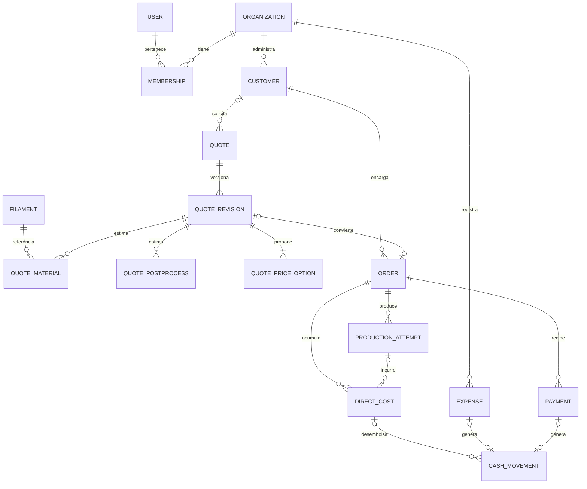

# Diseño de datos — Golden Print 3D

Fecha: 2026-10-02 · Autor: especialista existente `database_architect` · Estado: propuesta de blueprint; sin migraciones ni implementación.

Fuentes: solicitud original §1–§18, respuestas del propietario sobre usuarios, COP, anticipos, fórmula editable, postprocesado y reimpresiones; `framework/AGENTS.md`, `framework/docs/INVENTORY.md` y `framework/agents/architecture/database_architect.toml`. Fuente matemática: [FINANCIAL_RULES.md](FINANCIAL_RULES.md); adaptador: [TECHNOLOGY_STACK.md](TECHNOLOGY_STACK.md). Drizzle con pg pooled TCP en runtime Node es la propuesta; fijar versiones y verificar contratos antes de migrar.

## Decisiones y límites

- Neon PostgreSQL; modelo relacional normalizado. Una empresa Golden Print 3D, sin registro público posterior al primer administrador.
- IDs internos UUID; códigos visibles COT/PED por secuencia transaccional independiente, únicos y con huecos permitidos. No generar números contando filas ni usando MAX + 1.
- COP, sin impuestos; calendario empresarial America/Bogota. Instantes en `timestamptz`; fechas ingresadas como fechas empresariales en `date`.
- Cotización enviada/aceptada conserva la fórmula, materiales, tarifas, postprocesados, precio elegido y datos del cliente de esa revisión. Cambios posteriores de filamento/configuración no alteran esa evidencia.
- Costos estimados y reales son conjuntos diferentes. Cada reimpresión pertenece al mismo pedido mediante un nuevo intento. Contingencia es reserva comercial, sin egreso ni pérdida real automática.
- El MVP administra filamentos y sus precios, sin control de existencias, lotes, FIFO, depreciación contable, libro mayor ni almacenes. El peso del rollo permite calcular precio/gramo; no representa stock disponible.
- Postprocesado confirmado: sus líneas se suman al costo antes de aplicar multiplicadores. Contingencia se aplica únicamente sobre material.

## Tipos y convenciones

| Dato | Tipo conceptual | Regla |
|---|---|---|
| Identificador | uuid | PK, independiente de código visible |
| Importe COP publicado/cobrado | numeric(18,0) | Redondeo half-up al peso al precio final; pagos/gastos enteros; nunca float ni number JS para calcular |
| Gramos, precio/gramo, tarifas y componentes internos | numeric(18,6) | Precisión intermedia; cantidades y tarifas no negativas |
| Potencia y factores | numeric(12,6) | Potencia >= 0; multiplicadores > 0 y ordenados; contingencia entre 0 y 1 |
| Tiempo de impresión | bigint, segundos | >= 0; UI horas/minutos/segundos, conversión exacta |
| Fechas e instantes | date / timestamptz | Date para fecha comercial/pago/gasto; timestamptz para auditoría |
| Estado/rol/categoría | text + CHECK | Valores explícitos, migraciones para ampliarlos |
| Snapshot de fórmula | jsonb versionado | Parámetros de cálculo únicamente; materiales y costos son filas tipadas |

Las entidades de negocio tienen `created_at`, `updated_at`, `created_by` y `version` para edición optimista. Catálogos añaden `archived_at`. Las filas publicadas o financieras no usan eliminación física como mecanismo habitual. JSONB no sustituye claves externas ni importes tipados. El módulo financiero calcula con decimal y comparte reglas de redondeo entre validación, persistencia, PDF y métricas.

Los inputs se validan contra escala/rango numeric antes de calcular; no truncar entradas silenciosamente. Usar precisión decimal de 80 dígitos en el dominio. Calcular cada precio desde los inputs exactos del snapshot, redondearlo a COP entero, y solo después cuantizar componentes informativos a numeric(18,6). Nunca recalcular precios sumando subtotales o costos ya cuantizados. Un total fuera del rango persistible se rechaza con error de validación, sin overflow ni saturación. Ejemplo de regresión: 1 segundo, tarifa máquina 1799.999999, demás costos cero, multiplicador 3: precio exacto ≈1.499999999167, cobrable 1 COP; usar costo persistido 0.500000 incorrectamente produciría 2 COP.

## Esquema conceptual

### Empresa, usuarios y autenticación

| Entidad | Campos principales | Integridad |
|---|---|---|
| organization | id, singleton_key, name, currency, timezone, bootstrap_completed_at | singleton_key = 1 y UNIQUE; currency = COP; timezone = America/Bogota |
| user/session/account/verification | Tablas requeridas por Better Auth | Esquema exacto generado/adaptado para versión y ORM seleccionados; no crear un segundo almacén de contraseñas |
| membership | id, organization_id, user_id, role, active | UNIQUE(org,user); roles administrator/operator propuestos; FK user RESTRICT |
| business_settings | organization_id PK/FK, formula_version, machine_hour_rate, power_kw, energy_kwh_rate, contingency_rate, price_multipliers, updated_by, version | Una configuración actual por empresa; defaults 2000, 0.15, 1100, 0.10 y 2/2.5/3; solo administrador modifica |
| document_counter | organization_id, kind, next_value | PK(org,kind), kind COT/PED; bloqueo de fila y asignación dentro de transacción |

Permisos del operador: propuesta de operación comercial; detalle de lectura financiera y acciones sensibles se valida en la matriz de permisos de arquitectura. El modelo no concede permisos por pertenencia a una sesión: cada operación verifica membership activa y rol.

El bootstrap es provisionamiento privado por CLI de despliegue, sin signup público ni ruta web de instalación. El propietario introduce email/contraseña mediante entrada privada; el CLI calcula hash con la función soportada de Better Auth tras fijar su versión, sin registrar secretos. Una transacción Drizzle toma bloqueo común de instalación, verifica singleton no inicializado y crea user/account con el esquema exacto del adaptador, empresa, membership administrator, settings y counters; establece bootstrap_completed_at y hace commit. Toda creación de datos ocurre en esa misma transacción, sin llamar auth.api dentro de ella ni fingir que dos transacciones comparten atomicidad. Un fallo revierte; reejecución después de completado se rechaza. Antes de implementar se prueba que login Better Auth reconoce el hash/account creados; si su versión no permite este contrato, se revisa arquitectura antes de habilitar acceso. El registro inicial es este provisionamiento; los siguientes registros ocurren en panel de gestión administrativa mediante Better Auth admin y membership, nunca registro autónomo. Identidad sin membership no accede a negocio. Desactivar el último administrador se impide bajo bloqueo común de memberships para evitar dos desactivaciones simultáneas.

### Clientes y filamentos

| Entidad | Campos principales | Integridad |
|---|---|---|
| customer | id, org_id, name, contact_phone, email?, social_handle?, notes?, archived_at | Nombre/contacto obligatorios; no exigir unicidad de teléfono o email compartidos |
| filament | id, org_id, brand, model, material_type, color, purchase_value, roll_weight_g, archived_at | purchase_value >= 0, roll_weight_g > 0; precio/gramo = valor/peso, calculado por servicio decimal |

Filament es catálogo comercial; crear una ficha no registra una compra ni salida de caja. Una compra real se registra una vez en expense categoría material_purchase. Actualizar el catálogo cambia cálculos nuevos; las cotizaciones anteriores usan su snapshot. Dirección, proveedor, diámetro, ubicación y gramos restantes quedan NEXT/FUTURE.

### Cotizaciones y revisiones

| Entidad | Campos principales | Integridad |
|---|---|---|
| quote | id, org_id, sequence_number, code, customer_id?, current_revision_id, archived_at | UNIQUE(org,sequence_number), UNIQUE(org,code); customer opcional en borrador |
| quote_revision | id, org_id, quote_id, revision_number, status, project_name, description, client_snapshot?, print_seconds, formula_snapshot, material_cost, energy_cost, machine_cost, contingency_cost, postprocess_cost, estimated_cost, selected_option_id?, quoted_price?, business_date, valid_until?, customer_notes?, internal_notes?, sent_at?, accepted_at?, rejected_at? | UNIQUE(quote,revision_number); estados draft/sent/accepted/rejected/superseded; importes >= 0; notas cliente separadas de internas |
| quote_material | id, org_id, revision_id, filament_id, filament_snapshot, grams, price_per_gram, cost, position | grams > 0; precio/costo >= 0; snapshot contiene nombre/material/color relevante |
| quote_postprocess | id, org_id, revision_id, description, category, estimated_amount, position | Descripción requerida, importe >= 0; categorías flexibles sin tablas por actividad |
| quote_price_option | id, org_id, revision_id, level, label, multiplier, price, profit_value, margin_percent | UNIQUE(revision,level); 3 niveles iniciales; profit/margin recalculados por fuente financiera |

`current_revision_id` y `selected_option_id` deben apuntar a filas de la misma quote/revision; se valida por FK compuesta y escritura transaccional. Cliente opcional en cotización, obligatorio al confirmar un pedido. El snapshot del cliente preserva nombre/contacto presentes al publicar PDF aunque cambie su ficha. No duplicar en el pedido todo el desglose de la cotización.

Editar un draft modifica esa revisión con control de version. Editar un documento enviado crea revisión nueva; la anterior sigue consultable. Rechazar/aceptar registra estado y evento sin cambiar importes publicados. Una revisión aceptada vinculada a pedido no se sobrescribe ni se sustituye silenciosamente: ajustes comerciales posteriores requieren un flujo documentado de revisión, restringido si reducir precio lo deja por debajo del recaudo. Su diseño queda NEXT; el MVP permite ajustar antes de aceptación. Duplicar cotización crea quote y borrador nuevos, conservando fuente como referencia opcional; nunca copia aceptación ni pedido.

Fórmula confirmada: t = segundos/3600; material = suma(gramos × precio/gramo); energía = t × potencia × tarifa kWh; máquina = t × tarifa/h; contingencia = material × tasa; postprocesado = suma de sus líneas; costo = material + energía + máquina + contingencia + postprocesado; precios = costo × multiplicadores. Los valores 2, 2.5 y 3 son multiplicadores sobre costo; márgenes sobre venta son 50%, 60% y 66.666…% para costo positivo, antes de redondeo. Versionar cualquier cambio futuro de fórmula sin cambiar el significado de snapshots existentes.

### Pedidos y producción

| Entidad | Campos principales | Integridad |
|---|---|---|
| order | id, org_id, sequence_number, code, customer_id, source_quote_id?, accepted_revision_id?, title, status, order_date, promised_delivery_date?, confirmed_at?, delivered_at?, agreed_price?, cost_completeness, notes, version, archived_at? | UNIQUE(org,code/sequence_number); UNIQUE(source_quote_id), UNIQUE(accepted_revision_id) cuando no NULL; precio >= 0; estados not_started/printing/finished/delivered/damaged; completitud incomplete/complete |
| production_attempt | id, org_id, order_id, attempt_number, status, started_at?, completed_at?, actual_seconds?, failure_reason?, notes | UNIQUE(order,attempt_number); estados planned/printing/success/failed; segundos >= 0 |
| direct_cost | id, org_id, order_id, attempt_id?, category, economic_classification, cash_nature, description, incurred_date, quantity?, unit_cost?, amount, filament_id?, price_snapshot?, created_by, version, voided_at?, void_reason?, correction_of_id? | amount numeric(18,6) > 0; categoría material/energy/machine/postprocess/other; economic_classification variable/nonvariable, cash_nature monetary/nonmonetary; FK intento pertenece al mismo pedido; FK corrección mismo pedido/empresa |
| order_status_event | id, org_id, order_id, from_status?, to_status, occurred_at, actor_id, reason? | Historial append-only, actor identificable |

Crear un pedido sin cotización es intake provisional: `accepted_revision_id`, `confirmed_at` y `agreed_price` nulos. Tiene código/cliente/estado operativo pero no aumenta ventas ni admite pago/producción hasta vincular una cotización aceptada. Su badge de cotización será Falta por cotizar. Al confirmar, accepted_revision_id, confirmed_at y agreed_price se establecen juntos; agreed_price es snapshot monetario del contrato para bloquear pagos y consultas, no una copia editable independiente. UNIQUE(accepted_revision_id) garantiza una conversión máxima por revisión, y el servicio impide aceptar revisiones distintas del mismo quote para crear pedidos duplicados.

Una cotización solo puede originar un pedido comercial: bajo bloqueo de quote, la conversión consulta cualquier order enlazado a sus revisiones y devuelve el existente. Esta regla debe además quedar respaldada por `order.source_quote_id` UNIQUE/FK (junto con accepted_revision_id y comprobación de pertenencia), para impedir colisiones entre revisiones concurrentes.

Un fallo marca attempt failed y pedido damaged; reimprimir crea attempt_number siguiente en el mismo pedido y pasa a printing. Fallar no duplica el pedido, venta, pago ni costo de una impresión exitosa. El costo real total es suma de direct_cost del pedido, incluidos intentos fallidos; la parte de fallos se etiqueta pérdida analítica y no vuelve a restarse al calcular utilidad. Costos sin intento permiten postprocesado u otro costo general atribuible. No se genera costo real copiando automáticamente la contingencia o el estimado.

Completar/entregar requiere cierre de los costos reales conocidos; datos omitidos se marcan explícitamente como incompletos y las métricas no presentan el margen como definitivo. La máquina puede tener costo económico sin desembolso individual; un costo real no implica salida de caja automática.

### Pagos, gastos y caja

| Entidad | Campos principales | Integridad |
|---|---|---|
| payment | id, org_id, order_id, payment_date, amount, method?, reference?, notes?, actor_id, idempotency_key, created_at, voided_at?, void_reason?, correction_of_id? | amount entero > 0; UNIQUE(org,idempotency_key); pedido confirmado obligatorio; anulación solo corrección técnica auditada |
| expense | id, org_id, expense_date, description, classification, cost_behavior, category, amount, responsible_user_id, notes?, version, voided_at?, void_reason? | amount entero > 0; classification opex/material_purchase; OPEX cost_behavior fixed/variable; responsable membership de la empresa |
| independent_loss | id, org_id, recognized_date, category, description, amount, actor_id, origin_reference?, version, voided_at?, void_reason?, correction_of_id? | amount numeric(18,6) > 0; desperdicio u otro costo sin pedido; sin pago automático ni vínculo a un costo ya registrado; FK corrección misma empresa |
| cash_movement | id, org_id, business_date, direction, amount, source_kind, payment_id?, expense_id?, direct_cost_id?, independent_loss_id?, reference?, actor_id, voided_at?, correction_of_id? | amount entero > 0; direction in/out; exactamente una fuente; FK y unicidad por fuente según cardinalidad |
| audit_event | id, org_id, actor_id, entity_type, entity_id, action, occurred_at, metadata | Append-only, sin secretos de autenticación ni payloads sensibles completos |
| mutation_request | id, org_id, actor_id, operation, idempotency_key, input_hash, result_entity_type, result_entity_id, result_status, completed_at | UNIQUE(org_id,actor_id,operation,idempotency_key); resultado se guarda en la misma transacción de la mutación; sin passwords/payload financiero completo |

`mutation_request` respalda reintentos de gastos, costos e intentos además del ledger específico de pagos/conversión. Insertar/reservar key y ejecutar mutación en una sola transacción; concurrencia usa unique/lock y devuelve el resultado ya comprometido. Igual key con input_hash diferente devuelve conflicto; rollback retira la reserva y permite reintentar. Guardar referencia mínima al resultado/auditoría, no copiar datos sensibles de respuesta; reautorizar antes de devolver un resultado existente. Mantener las claves mientras exista el registro financiero/operativo correspondiente, sin expiración automática que permita duplicarlo. Las FK de resultado concretas o referencias comprobadas por servicio deben impedir apuntar a otro negocio.

Corrección de costo/pérdida: bloquear pedido/origen y comprobar versión; anular fila anterior con motivo y crear reemplazo con correction_of_id en la misma transacción. Toda agregación suma solo filas válidas actuales (`voided_at IS NULL`), filtradas por fecha efectiva; corregir 100 a 120 produce 120, nunca 220. Si hay caja asociada, solo administrador y no reducir importe económico por debajo de la suma de egresos válidos asociados: rechazar con conflicto y exigir primero una corrección técnica explícita del registro de egreso incorrecto. La corrección de costo migra las referencias de egresos válidos al reemplazo con auditoría en esa misma transacción, preservando importe/fecha reales y saldo desembolsable; no crea devolución ni otro pago. Pérdidas con caja siguen la misma regla. Para cambios de importe/fecha del propio egreso, anular/reemplazar movimiento solo como corrección de error real auditada, nunca como reintegro.

Notas de cotización: `quote_revision.customer_notes` (texto que puede entregarse al cliente) y `quote_revision.internal_notes` (privado) reemplazan el campo genérico `notes`. DTO `customerNotes` mapea solo al primero, `internalNotes` solo al segundo. Ambos forman parte del snapshot de revisión. PDF usa una allowlist explícita de datos comerciales y customer_notes; nunca serializa la revisión completa ni incluye internal_notes, desglose, tarifas o márgenes. Cliente opcional en publicación/PDF: mostrar «Sin cliente» cuando no exista; exigir cliente al convertir a pedido.

Payment es ledger positivo de anticipos/abonos. Estado de pago y saldo son derivados: paid = suma(pagos válidos), saldo = agreed_price − paid; Pendiente de pago mientras saldo > 0, Pagado al llegar a 0. Mostrar importe recibido y saldo para identificar pago parcial sin inventar un tercer estado confirmado por usuario. No existe operación de marcar pagado sin registrar un pago.

Cada pago crea exactamente un cash_movement in por el mismo importe/fecha; cada expense válido crea un cash_movement out. En material_purchase no hay OPEX ni direct_cost automático: el consumo se registra luego como costo real material. Así se separa compra/caja del costo de consumo sin implementar inventario avanzado. Para costos directos pagados realmente, cash_movement out puede enlazar a direct_cost; suma de desembolsos de ese costo no supera amount. Un costo material consumido de una compra ya registrada no genera otro desembolso. Para energía, máquina o postprocesado que ya figuren en un pago global de gasto, se usa una única fuente de caja; no registrar otro egreso por cada pedido. La regla UI/servicio debe advertir el origen y permitir mantener costo económico sin desembolso directo.

La tabla cash_movement no es un formulario genérico de egresos: solo la crean los flujos de pagos, gastos y desembolsos directos con origen identificable. UNIQUE(payment_id) y UNIQUE(expense_id) evitan dobles movimientos, usando índices parciales para filas activas si hay correcciones. Producción real y OPEX tienen clasificaciones excluyentes; un egreso asignado directamente a pedido no se clasifica además OPEX. No se suman compras de material a la utilidad como si fueran consumo.

Sin devoluciones, pagos confirmados no se borran ni reducen mediante edición común. Corrección técnica de digitación: administrador bloquea pedido y payment, exige motivo, conserva fila original con voided_at y cash_movement original igualmente anulado, y opcionalmente registra reemplazo positivo con correction_of_id y nueva entrada de caja fuente válida en la misma transacción. Se valida saldo neto después del reemplazo. La operación no representa devolución, no crea pago negativo y es visible en historial; su acceso administrativo requiere confirmación explícita y advertencia de recálculo. Gastos sin dependencias pueden editarse/anularse con auditoría y ajuste atómico de su movimiento de caja; anular no borra evidencia. Bloquear cancelación de pedido con pagos y rebaja de precio por debajo de lo recibido.

Independent_loss permite desperdicio sin pedido en MVP, con fecha e importe económico y sin repetir un consumo direct_cost ni producir caja automática. Por ejemplo, filamento perdido previamente comprado puede tener pérdida económica y ningún egreso nuevo. Si existe desembolso directo por una pérdida independiente, se amplía cash_movement con independent_loss_id como fuente exclusiva y se conserva la misma regla de registro único. Pérdidas por incobrables y condonación quedan NEXT: requieren write-off de cartera, sin simular pagos ni devoluciones. Reportar solo pérdidas efectivamente registradas; un saldo pendiente no es automáticamente incobrable.

## Restricciones y concurrencia

| Garantía | Base de datos | Servicio/transacción |
|---|---|---|
| Empresa única | singleton UNIQUE/CHECK | Bootstrap CLI privado; identidad/account/membership/configuración atómicos |
| Pertenencia | org_id en negocio; FK compuestas (org_id,id) | No aceptar org_id del navegador como autoridad; membership activa |
| Dinero válido | numeric, NOT NULL, CHECK positivos/no negativos | Decimal, redondeo, máximos, fórmulas versionadas |
| Documentos únicos | Contador PK y códigos UNIQUE | Bloquear contador, asignar y guardar juntos; no reutilizar códigos |
| Conversión única | UNIQUE(source_quote_id), UNIQUE(accepted_revision_id) | Bloquear quote; comprobar accepted, cliente y devolver pedido existente |
| Pago no supera saldo | CHECK amount > 0, FK, idempotencia UNIQUE | Bloquear order, sumar ledger y validar monto <= saldo en misma transacción |
| Edición sin pérdida | version | UPDATE condicionado a versión; conflicto devuelve recarga/comparación |
| Revisión inmutable | FK RESTRICT, diseño append-only | Rechazar cambios en filas de revisión publicada; privilegios DB/app limitados |
| Costos consistentes | FK compuestas, importes válidos | Actualizar componentes/totales conjuntamente; nunca confiar totales del cliente |
| Último administrador | membership UNIQUE y FK | Bloqueo común antes de desactivar/cambiar rol; comprobar administrador activo restante |
| Estado/pago no divergente | Pago no tiene status manual | Transiciones y lectura derivados por fuente financiera |

FK referenciales usan RESTRICT para clientes/materiales/usuarios con historia. Solo hijos de un draft sin referencias pueden eliminarse con su padre; no aplicar cascadas que borren pagos, pedidos, costos, revisiones publicadas o auditoría. El diseño no confía en CHECK para reglas agregadas entre filas: sobrepago, último administrador y totales derivados requieren transacciones y bloqueo.

Aislamiento READ COMMITTED con bloqueo explícito del padre es suficiente si todas las escrituras respetan el protocolo; serializable se evalúa para bootstrap/operaciones excepcionales. Conflictos de serialización/deadlock se reintentan con límite e idempotency_key. La integración Neon/ORM debe soportar transacciones interactivas/bloqueos del driver escogido; no abrir una transacción que incluya render PDF, email o llamada de red externa.

## Consultas, fechas e índices

- Índices en cada FK; UNIQUE compuestos incluyen org_id para cumplir ownership relacional.
- orders(org_id,status,order_date DESC), orders(org_id,customer_id,confirmed_at DESC), orders(org_id,confirmed_at), orders(org_id,delivered_at).
- quote(org_id,customer_id,created_at DESC), quote_revision(quote_id,revision_number DESC), quote_revision(org_id,status,business_date DESC).
- payment(org_id,order_id,payment_date), payment(org_id,payment_date); direct_cost(org_id,order_id,incurred_date), production_attempt(order_id,attempt_number).
- expense(org_id,expense_date,classification), expense(org_id,category,expense_date); cash_movement(org_id,business_date,direction) para filas válidas.
- Búsqueda inicial por código/nombre/cliente y paginación; añadir pg_trgm solo si datos reales justifican búsqueda parcial lenta. No materializar balances ni crear warehouse en MVP.

Valor comprometido filtra `confirmed_at`; ventas reconocidas, tanto en dashboard como en finanzas, filtran `delivered_at` y suman precios/costos reales de esos pedidos acumulados al cierre. Costos de pedidos aún no entregados son trabajo en proceso. Costos incurridos tienen serie propia por incurred_date. Recaudo y caja filtran payment_date/cash business_date y pueden corresponder a ventas de períodos anteriores. Cartera global al cierre incluye todos los pedidos confirmados hasta cierre y pagos hasta esa fecha; tasa de cobro de la cohorte entregada utiliza pagos acumulados de esos mismos pedidos hasta corte dividido por sus ventas reconocidas. No mezclar recaudo fechado de otra cohorte. Punto de equilibrio utiliza economic_classification variable/nonvariable de costos directos y cost_behavior fixed/variable de OPEX; cash_nature evita generar efectivo a partir de asignaciones económicas. Independent_loss se deduce una vez aparte de costos de intento fallido, ya incluidos costo real. Límites y fórmulas exactos pertenecen a FINANCIAL_RULES.md.

Customer cantidad/ventas/último pedido/cartera y ranking son agregaciones de orders confirmados y ledger, no columnas acumuladas editables en customer. Utilidad, márgenes y estado de pago también son consultas de la fuente financiera, con denominadores cero explícitos. Los resultados distinguen estimación y real; una impresión no realizada no tiene costo real cero presentado como rentabilidad final.

## Ejemplos de operaciones atómicas

1. **Enviar cotización:** validar cliente si corresponde, fórmula resuelta, costos/opciones y nivel seleccionado; verificar version; recalcular en servidor; persistir snapshot y componentes; pasar a sent con fecha/auditoría. Render PDF después del commit desde esa revisión.
2. **Aceptar y convertir:** bloquear quote y revisión; comprobar estado aceptable y ausencia de otro pedido fuente; establecer accepted, asignar código PED bajo contador y crear/vincular pedido provisional con cliente/precio/confirmed_at; evento/auditoría; commit. Un segundo request devuelve mismo order por source_quote_id.
3. **Abono:** comprobar idempotency_key antes de mutar; bloquear order confirmado; calcular saldo con pagos válidos; rechazar exceso; insertar payment y su cash_movement in y auditoría; commit. Dos abonos simultáneos que juntos superen saldo no pueden ambos pasar.
4. **Fallo y reimpresión:** cerrar intento actual con costos/reason y evento damaged; crear siguiente intento del mismo pedido bajo bloqueo order; volver printing; conservar costos anteriores y payment ledger. Reintento técnico usa key o version para no crear intentos duplicados.
5. **Compra material:** crear expense material_purchase y salida caja única; opcionalmente actualizar ficha filament/precio para cotizaciones futuras. Consumir después registra direct_cost sin repetir caja ni transformar compra en OPEX.
6. **Anular gasto:** verificar rol/version y dependencias; marcar expense y movimiento fuente anulado con motivo/auditoría en misma transacción. Los reportes usan las filas válidas y corregidas actuales, filtradas por fecha efectiva; una corrección reexpresa períodos anteriores. La auditoría conserva original, actor y motivo, pero el MVP no reconstruye lo conocido en una fecha histórica ni ofrece cierre contable inmutable.

## Migraciones y verificación previstas

1. Fijar versiones Drizzle/pg/Better Auth, contratos de adapter/driver Neon y hash/provisionamiento; fórmula postprocesado ya confirmada; revisión cruzada de restricciones y permisos.
2. Crear migraciones versionadas: auth → empresa/membership/settings/counters → catálogos → cotizaciones/revisiones → pedidos/intentos/costos → pagos/gastos/caja → índices/auditoría.
3. Aplicar primero en Neon de desarrollo/preview; separar DB productiva, secretos y bootstrap. Seed de defaults no crea credenciales predeterminadas ni usuarios públicos.
4. Validar migración desde DB vacía, rollback documentado de cambios reversibles y restauración de backup/branch antes de cambios destructivos. Preferir expand/migrate/contract cuando haya datos; no resetear producción.
5. Tests necesarios: FK entre empresas, conversión simultánea/repetida, bootstrap concurrente/restringido, último administrador, dos abonos concurrentes, idempotencia, freeze de revisión, edición optimista, pérdida incluida una vez, compra material sin doble OPEX/caja, fechas Bogotá, exactitud decimal y PDF desde snapshot.
6. Validar consultas con EXPLAIN y datos representativos al existir implementación; los índices propuestos no son una medición de rendimiento. Estimar volumen/retención real tras operación; sin particionado ni caché distribuida inicial.

## Pendientes que afectan el cierre

- Postprocesado resuelto por propietario: se suma antes de multiplicadores, contingencia sigue exclusivamente sobre material.
- Alinear alcance de incobrables NEXT, pérdidas independientes y correcciones técnicas auditadas MVP con PRD; sin devoluciones.
- Incorporar nombres/permisos exactos de roles desde arquitectura y esquema auth del ORM final antes de migraciones.
- Revisión del orquestador y de integridad financiera requerida. Este archivo documenta diseño conceptual; no confirma schema creado, tests ejecutados ni blueprint aprobado.
